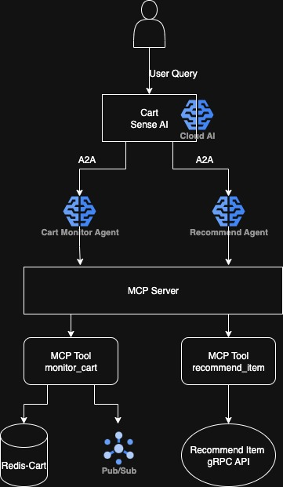

**Cart Sense AI** is a GKE based Agentic Framework demo that enhances Online Boutique - a Google E-Commerce GKE application, built as part of GKE Hackathon.

We use this application to demonstrate how we built Google ADK, A2A Protocol, and MCP Server in GKE to enhance Online Boutique application with Generative AI capabilities.


## Architecture

**Online Boutique** is composed of 11 microservices written in different
languages that talk to each other over gRPC.

[](GKE-hackathon.jpg)

Find Architecture of Online Boutique on their repository
Find **Protocol Buffers Descriptions** at the [`./protos` directory](/protos).


## Quickstart (GKE)

1. Ensure you have the following requirements:
   - [Google Cloud project](https://cloud.google.com/resource-manager/docs/creating-managing-projects#creating_a_project).
   - Shell environment with `gcloud`, `git`, and `kubectl`.

2. Clone the latest major version.

   ```sh
   mkdir workspace

   git clone --depth 1 --branch v0 https://github.com/GoogleCloudPlatform/microservices-demo.git
   cd microservices-demo/

   git clone https://github.com/TomMLe/gke-hackathon.git
   ```

   Clone both Online Boutique and Cart Sense AI

3. Set the Google Cloud project and region and ensure the Google Kubernetes Engine API is enabled.

   ```sh
   export PROJECT_ID=<PROJECT_ID>
   export REGION=us-west1
   gcloud services enable container.googleapis.com \
     --project=${PROJECT_ID}
   ```

   Substitute `<PROJECT_ID>` with the ID of your Google Cloud project.

4. Create a GKE cluster and get the credentials for it.

   ```sh
   gcloud container clusters create-auto online-boutique \
     --project=${PROJECT_ID} --region=${REGION}
   ```

   Creating the cluster may take a few minutes.

5. Build your agents and MCP Server

   ```sh
   cd ~/workspace/gke-hackathon/mcp_server
   gcloud builds submit --tag us-west1-docker.pkg.dev/$PROJECT_ID/gke-hackathon/mcp-server:latest --project=$PROJECT_ID

   cd ~/workspace/gke-hackathon/adk_agent
   gcloud builds submit --tag us-west1-docker.pkg.dev/$PROJECT_ID/gke-hackathon/adk-agent:latest --project=$PROJECT_ID

   cd ~/workspace/gke-hackathon/adk-agent/cart_monitor_agent
   gcloud builds submit --tag us-west1-docker.pkg.dev/$PROJECT_ID/gke-hackathon/cart-monitor-agent:latest --project=$PROJECT_ID

   cd ~/workspace/gke-hackathon/adk-agent/recommend_agent
   gcloud builds submit --tag us-west1-docker.pkg.dev/$PROJECT_ID/gke-hackathon/recommend-agent:latest --project=$PROJECT_ID
   ```

6. Obtain your GOOGLE GEN AI API KEY and populate it in the deployment yamls files in the step below

6. Deploy Online Boutique to the cluster.

   ```sh
   cd ~/workspace/microservices-demo
   kubectl apply -f ./release/kubernetes-manifests.yaml

   cd ~/workspace/gke-hackathon
   kubectl apply -f ./mcp-server/deployment_ob_mcp.yaml
   kubectl apply -f ./adk-agent/cart-monitor-agent/deployment_cart_monitor.yaml
   kubectl apply -f ./adk-agent/recommend-agent/deployment_recommend.yaml
   kubectl apply -f ./adk-agent/deployment_agent.yaml

   ```

7. Wait for the pods to be ready.

   ```sh
   kubectl get pods
   ```

   After a few minutes, you should see the Pods in a `Running` state:

   ```
   NAME                                     READY   STATUS    RESTARTS       AGE
   adk-agent-5f97fcc7d6-r4tmd               1/1     Running   0              3h42m
   adservice-5cb4cf69f6-vmw54               1/1     Running   0              20h
   cart-monitor-agent-b668b955-9rxqv        1/1     Running   0              4h51m
   cartservice-77ccfd5bf8-rvwlc             1/1     Running   0              20h
   checkoutservice-795748f6f9-572sx         1/1     Running   0              20h
   currencyservice-547645697c-mhkpf         1/1     Running   17 (95m ago)   3d5h
   emailservice-988df6d5f-p6w4z             1/1     Running   1 (3d5h ago)   3d5h
   frontend-84db48ccc8-g6wwm                1/1     Running   0              20h
   loadgenerator-68bfb6f97f-mdfkz           1/1     Running   0              20h
   ob-mcp-server-655ccd54cb-p9kmw           1/1     Running   0              3d5h
   orchestrator-agent-9b4fdf594-h2m9r       1/1     Running   0              2d21h
   paymentservice-6cbd849f9-45dwt           1/1     Running   12 (38m ago)   2d14h
   productcatalogservice-848d554b95-fvgx5   1/1     Running   0              3d5h
   recommend-agent-8596b6d7b-bwqxk          1/1     Running   0              4h51m
   recommendationservice-7d6fbb5f46-rbxww   1/1     Running   1 (3d5h ago)   3d5h
   redis-cart-76ff8946b4-8p6bc              1/1     Running   0              34h
   shippingservice-6cb5bb4f87-x9gzm         1/1     Running   0              3d2h
   ```

8. Access the web frontend in a browser using the frontend's external IP.

   ```sh
   kubectl get service frontend-external | awk '{print $4}'
   ```

   Visit `http://EXTERNAL_IP` in a web browser to access your instance of Online Boutique.

9. Port forward the cart-sense-ai assistant in a browser

   ```sh
   kubectl port-forward svc/adk-agent 8080:80
   ```

   Visit `localhost:8080` in a web browser to access your instance of Cart Sense AI

10. To Test, go the instance of Online Boutique and add a couple of items in the cart. Wait 150 secs. Navigate to Cart Sense AI and prompt the orchestrator agent.

   Example prompts:
   
   `monitor abandoned carts with fashion items`
   
   `recommend items based on product OLJCESPC7Z`
   
   `monitor abandoned carts with fashion items, then recommend other fashion items based on the items on the carts`

11. Once you are done with it, delete the GKE cluster.

   ```sh
   gcloud container clusters delete online-boutique \
     --project=${PROJECT_ID} --region=${REGION}
   ```

   Deleting the cluster may take a few minutes.

## Learning Resources

- **Ray MCP Tutorial**: [https://gke-ai-labs.dev/docs/agentic/ray-mcp/](https://gke-ai-labs.dev/docs/agentic/ray-mcp/).
- **Google A2A**: [Google A2A MCP Tutorials](https://cloud.google.com/blog/products/ai-machine-learning/unlock-ai-agent-collaboration-convert-adk-agents-for-a2a?hl=en&_gl=1*whzhp0*_ga*MTQ5NzQ1MTc3NC4xNzQ1MDEyNDYz*_ga_WH2QY8WWF5*czE3NTYxNTI1MTYkbzE1JGcxJHQxNzU2MTUyODY3JGo0OCRsMCRoMA..)


## Documentation

- Google A2A Python SDK
- Google ADK Python SDK
- Google Gen AI Python SDK

## Demos 

- [Youtube](https://medium.com/p/d99101001e69)
